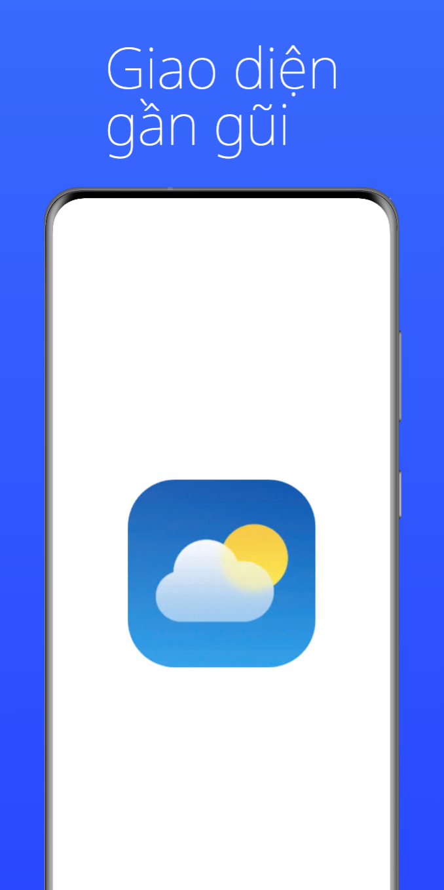
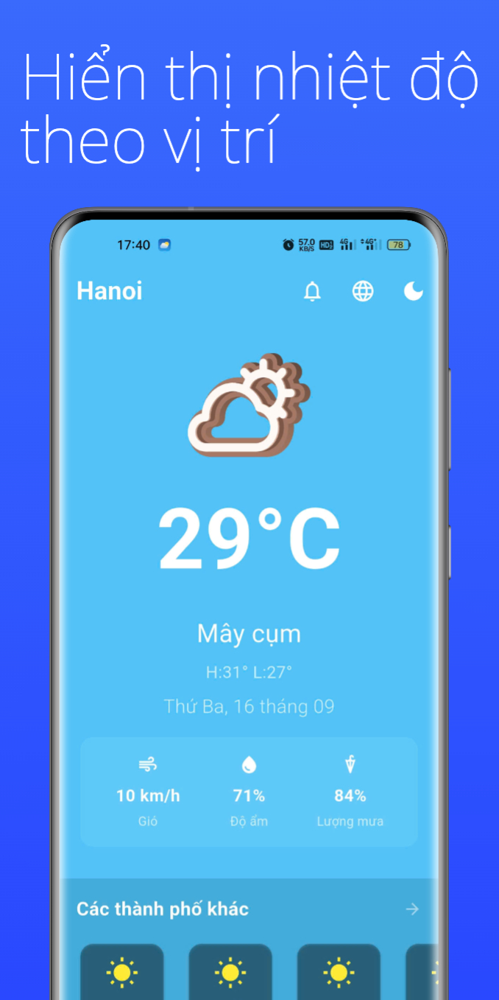
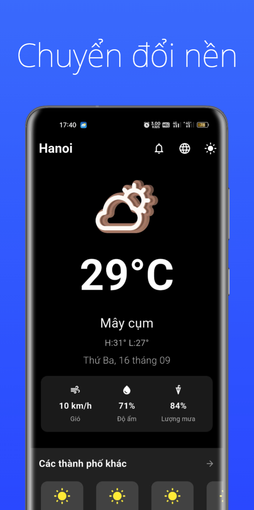
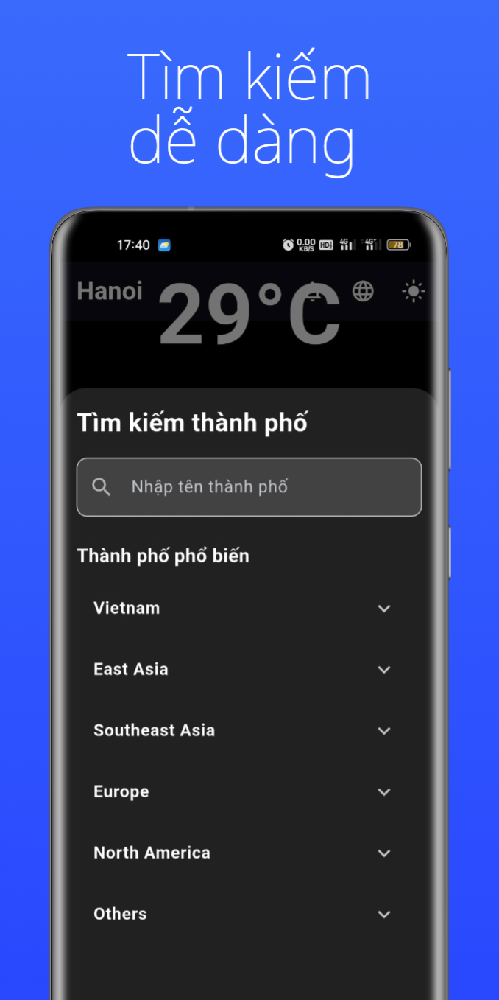

# Weather Today (Ứng dụng thời tiết)

Ứng dụng Weather Today cung cấp thông tin thời tiết nhanh, trực quan và bản đồ dự báo cho vị trí của bạn. Ứng dụng đã được phát hành trên Google Play Store: https://play.google.com/store/apps/details?id=com.zamoon6.weather_today&pcampaignid=web_share

---

Weather Today provides fast, clear weather information and forecasts for your current location. The app is published on Google Play Store: https://play.google.com/store/apps/details?id=com.zamoon6.weather_today&pcampaignid=web_share

Features include current conditions, hourly/daily forecasts, localization (EN/VI), and location-based weather.

See the Vietnamese sections below for full developer and build instructions.

---

## Tổng quan / Overview

- Tên / Name: Weather Today
- Package (Play Store): `com.zamoon6.weather_today`
- Link cửa hàng / Store link: https://play.google.com/store/apps/details?id=com.zamoon6.weather_today&pcampaignid=web_share

Ứng dụng hiển thị nhiệt độ hiện tại, dự báo theo giờ/ngày, thông tin gió, độ ẩm và biểu tượng thời tiết sinh động. Hỗ trợ đa ngôn ngữ (Tiếng Việt và Tiếng Anh) và tích hợp định vị để lấy dữ liệu cho vị trí hiện tại.

The app shows current temperature, hourly/daily forecasts, wind, humidity, and lively weather icons. Supports localization (Vietnamese and English) and integrates location services to fetch weather for the current position.

## Tính năng chính / Key Features

- Xem thời tiết hiện tại (nhiệt độ, cảm giác như, độ ẩm, áp suất, tốc độ gió)
- Dự báo theo giờ và theo ngày
- Hỗ trợ định vị để tự động lấy thời tiết vị trí hiện tại
- Giao diện trực quan với icon/animation
- Hỗ trợ đa ngôn ngữ (`en` và `vi` trong `translations/`)
- Thông báo (tùy cấu hình)

- View current conditions (temperature, feels-like, humidity, pressure, wind speed)
- Hourly and daily forecasts
- Location support to auto-fetch local weather
- Clean UI with icons/animations
- Localization (`en` and `vi` in `translations/`)
- Notifications (configurable)

## Công nghệ / Technology

- Flutter (mobile cross-platform)
- Plugins: geolocator, firebase, notifications, etc. (see `pubspec.yaml`)

## Yêu cầu môi trường phát triển / Development requirements

- Flutter SDK — check with `flutter --version`
- Android SDK (for Android builds)
- macOS (development tested on macOS)

## Chạy ứng dụng (phát triển) / Run (development)

1. Clone repository:

```bash
git clone <repo-url>
cd weather-app
```

2. Install dependencies:

```bash
flutter pub get
```

3. Run on emulator or device:

```bash
flutter run
```

Note: enable location permissions on the emulator/device when testing location features.

## Build release cho Android (APK / AAB) / Android release build

1. Create a signing key (if you don't have one) and configure `key.properties` / `app/build.gradle.kts`.

2. Build APK:

```bash
flutter build apk --release
```

3. Or build App Bundle (AAB) for Play Store:

```bash
flutter build appbundle --release
```

4. Output files are in `build/app/outputs/`.

Note about signing: the repository contains `app/my-release-key.jks` and `key.properties` configured; keep keys secure and avoid publishing secrets.

## Quyền truy cập (Permissions) / Permissions

Ứng dụng yêu cầu:
- Vị trí: để lấy dữ liệu thời tiết cho vị trí hiện tại
- Internet: để truy vấn API thời tiết

The app requests:
- Location: to fetch weather for the current position
- Internet: to call weather APIs

See `android/app/src/main/AndroidManifest.xml` for declared permissions.

## Localization (Đa ngôn ngữ)

Thư mục `translations/` chứa `en.json` và `vi.json`. Ứng dụng chọn ngôn ngữ theo hệ thống hoặc cấu hình trong app.

## Play Store

Ứng dụng đã được phát hành trên Google Play Store:

https://play.google.com/store/apps/details?id=com.zamoon6.weather_today&pcampaignid=web_share

The app is available on Google Play: same link above.

## Quyền riêng tư và dữ liệu / Privacy & Data

Ứng dụng sử dụng dữ liệu vị trí và kết nối mạng chỉ để cung cấp thông tin thời tiết. Nếu bạn có trang Privacy Policy, hãy cập nhật link ở đây.

The app only uses location and network data to provide weather information. Add a Privacy Policy URL if available.

## Ảnh màn hình / Screenshots







## Đóng góp / Contributing

Chào mừng mọi đóng góp! Vui lòng gửi Pull Request hoặc mở Issue.

Steps:
- Fork repository
- Create branch: `git checkout -b feature/your-feature`
- Commit & push
- Open PR with description

Before PR: run `flutter analyze` and `flutter test` (if tests exist).

## License

This project is licensed under the MIT License — see `LICENSE` file.

## Liên hệ / Contact

- Tác giả/Repository owner: Thuongle2112
- Play Store: https://play.google.com/store/apps/details?id=com.zamoon6.weather_today&pcampaignid=web_share

---

Getting Started (English resources)

For help getting started with Flutter development, view the
[official documentation](https://docs.flutter.dev/) which offers tutorials, samples, and API reference.


